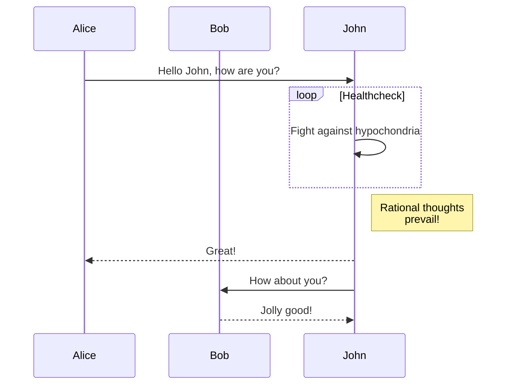
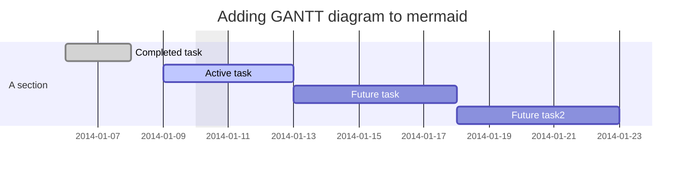

# Markdown

Markdown is a lightweight markup language for creating formatted text.

## Generator

- [tablesgenerator.com/markdown_tables](https://www.tablesgenerator.com/markdown_tables){:target="_blank"}
- [tree.nathanfriend.io](https://tree.nathanfriend.io){:target="_blank"}

## LaTeX

```markdown
$x + y = 1$
```

$x + y = 1$

## mermaid

Generation of diagram and flowchart from text in a similar manner as markdown.

- [mermaid-js.github.io/mermaid](https://mermaid-js.github.io/mermaid){:target="_blank"}
- [github.com/mermaid-js/mermaid](https://github.com/mermaid-js/mermaid){:target="_blank"}

Flowchart

```markdown
graph TD;
    A-->B;
    A-->C;
    B-->D;
    C-->D;
```


SequenceDiagram

```markdown
sequenceDiagram
    participant Alice
    participant Bob
    Alice->>John: Hello John, how are you?
    loop Healthcheck
        John->>John: Fight against hypochondria
    end
    Note right of John: Rational thoughts <br/>prevail!
    John-->>Alice: Great!
    John->>Bob: How about you?
    Bob-->>John: Jolly good!
```



Gantt diagram

```markdown
gantt
dateFormat  YYYY-MM-DD
title Adding GANTT diagram to mermaid
excludes weekdays 2014-01-10

section A section
Completed task            :done,    des1, 2014-01-06,2014-01-08
Active task               :active,  des2, 2014-01-09, 3d
Future task               :         des3, after des2, 5d
Future task2              :         des4, after des3, 5d
```


